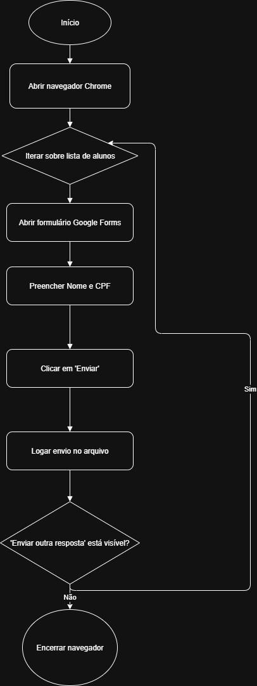

# 📝 Preenchimento Automático de Formulário Google Forms com Python

Este projeto automatiza o preenchimento de um formulário do Google Forms utilizando Python, Selenium e WebDriver Manager. Os dados dos alunos (nome e CPF) são inseridos automaticamente e os envios são registrados em um arquivo de log (`log_envios.txt`).

---

## 🚀 Funcionalidades

- Preenche um formulário do Google Forms com Nome e CPF.
- Usa o `webdriver-manager` para baixar o ChromeDriver automaticamente.
- Gera logs de cada envio ou erro em `log_envios.txt`.
- Pode ser expandido com geração automática de CPFs e leitura de dados de um arquivo.

---

## 📦 Requisitos

- Python 3.8 ou superior
- Google Chrome instalado
## 📊 Diagrama de Fluxo da Automação Selenium

